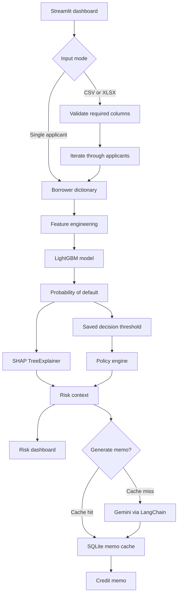

# Hybrid Credit Risk Engine

An explainable credit-risk application for screening borrowers and supporting
underwriting review. The project combines a LightGBM probability model with a
saved decision threshold, SHAP explanations, deterministic policy rules, and
optional AI-generated credit memos.

The user interface is a Streamlit dashboard. It supports both individual
assessments and bulk scoring from a CSV or Excel file.

> This application is decision support, not an automatic approval or rejection
> system. The policy engine returns a recommended next underwriting action for
> human review.

## What the application does

- Scores a borrower with the trained LightGBM model.
- Converts the model probability into a `Default Risk` or `Non-Default Risk`
  decision using the saved threshold.
- Calculates local SHAP values and separates factors that increase or decrease
  predicted default risk.
- Applies policy bands:
  - **High**: probability `>= 0.20` — Enhanced underwriting review
  - **Moderate**: probability `>= 0.10` and `< 0.20` — Additional underwriting review
  - **Low**: probability `< 0.10` — Standard underwriting review
- Generates a structured credit memo with Gemini when requested.
- Caches generated memos in `memo_cache.db` so the same borrower does not
  require another model call.

## Architecture



The assessment path does not call the LLM. This keeps scoring, policy
classification, and explanations reproducible and allows users to inspect the
model result before requesting a memo.

## Input features

Bulk files must contain these ten columns. Values are converted to numeric
values before scoring:

| Column | Description |
| --- | --- |
| `CreditUtilization` | Revolving credit utilization ratio |
| `Age` | Borrower age |
| `Late30-59DaysPastDue` | Number of payments 30–59 days past due |
| `DebtRatio` | Debt-to-income style ratio used by the model |
| `MonthlyIncome` | Monthly income |
| `OpenCreditLines` | Number of open credit lines |
| `Late90DaysPastDue` | Number of payments 90+ days past due |
| `RealEstateLoans` | Number of real-estate loans or lines |
| `Late60-89DaysPastDue` | Number of payments 60–89 days past due |
| `Dependents` | Number of dependents |

Two additional model features are calculated automatically:

- `TotalLate` = the sum of the three past-due count columns.
- `IncomePerPerson` = `MonthlyIncome / (Dependents + 1)`.

The input file may contain extra columns; the dashboard ignores them after
checking that all required columns are present.

## Project layout

```text
.
├── app.py                         # Streamlit dashboard
├── src/
│   ├── cache.py                   # SQLite memo cache
│   ├── feature_engineering.py    # Model input preparation
│   ├── memo_generator.py          # Gemini memo generation
│   ├── model.py                   # Model, threshold, and SHAP loading
│   ├── pipeline.py                # Assessment and memo orchestration
│   ├── policy_engine.py           # Risk bands and recommended actions
│   └── risk_engine.py             # Prediction, SHAP, and risk context
├── models/
│   ├── credit_risk_lgbm.pkl       # Trained LightGBM model
│   └── credit_risk_threshold.pkl  # Saved classification threshold
├── data/
│   ├── raw/                       # Source CSV/XLS files and data dictionary
│   └── processed/                 # Cleaned training data
├── nootbooks/                     # EDA, cleaning, and model-development notebooks
├── test_cache.py                  # Cache smoke test
├── test_pipeline.py               # Assessment smoke test
└── pyproject.toml                 # Dependencies and project configuration
```

## Requirements

- Python 3.14 or newer
- The model files in `models/`
- A Google Gemini API key for AI memo generation
- [`uv`](https://docs.astral.sh/uv/) is recommended for environment and
  dependency management

## Setup

Create the environment and install the locked dependencies:

```bash
uv sync
```

Create a `.env` file in the project root for memo generation:

```dotenv
GOOGLE_API_KEY=your-google-api-key
```

The dashboard can perform model scoring without generating a memo, but the
Google API key must be available when a memo is requested.

## Run the dashboard

```bash
uv run streamlit run app.py
```

Then open the local URL printed by Streamlit. Choose one of the two tabs:

1. **Bulk Applicants** — upload a `.csv` or `.xlsx`, review the input, and
   select **Assess All Applicants**.
2. **Single Applicant** — enter the ten borrower fields and select
   **Assess Credit Risk**.

After scoring, select **Generate Credit Memo** to request the memo for a
specific applicant. Bulk assessment itself does not call Gemini.

## Use the Python pipeline

The same scoring logic is available without Streamlit:

```python
from src.pipeline import CreditRiskPipeline

borrower = {
    "CreditUtilization": 0.50,
    "Age": 40,
    "Late30-59DaysPastDue": 0,
    "DebtRatio": 0.50,
    "MonthlyIncome": 8000.0,
    "OpenCreditLines": 10,
    "Late90DaysPastDue": 0,
    "RealEstateLoans": 1,
    "Late60-89DaysPastDue": 0,
    "Dependents": 1,
}

pipeline = CreditRiskPipeline()
assessment = pipeline.assess(borrower)

print(assessment["risk_context"])
```

Use `pipeline.run(borrower)` when both the assessment and the AI memo are
needed. `pipeline.assess()` is the local-only path; `pipeline.generate_memo()`
checks the SQLite cache before calling Gemini.

## Tests and development notebooks

The repository currently uses executable smoke-test scripts rather than a
pytest suite:

```bash
uv run python test_cache.py
uv run python test_pipeline.py
```

`test.py` and `test_pipeline_cache.py` exercise memo generation and therefore
require `GOOGLE_API_KEY` and network access to Gemini.

The notebooks under [`nootbooks/`](./nootbooks/) document the model-development
workflow:

1. Exploratory analysis of the source credit dataset.
2. Cleaning and renaming the original columns.
3. Train/validation/test splitting.
4. Feature engineering, LightGBM comparison and tuning.
5. Threshold selection and SHAP-based interpretation.

The trained artifacts are already checked into `models/`; retraining is not
required to run the dashboard.

## Notes on the model output

The saved threshold controls the model's binary decision. It is separate from
the policy engine's three risk bands, which provide the recommended review
action. SHAP values explain the direction and relative contribution of features
for an individual prediction; they are not percentages and should not be read
as causal effects.

Generated memos are constrained to the structured risk context produced by the
engine. They are intended to summarize evidence and the recommended next
underwriting action, not to replace underwriting judgment.
